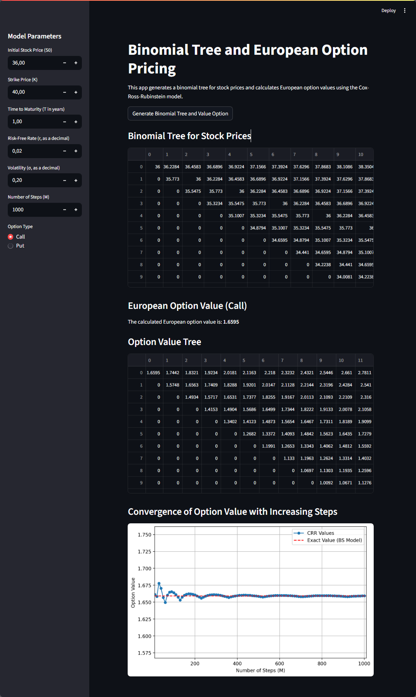

# Binomial Options Pricing

This Streamlit app calculates **European option prices** using the **Cox–Ross–Rubinstein (CRR)** model.  
It also:
- Generates a **binomial tree** for stock prices
- Produces an **option value tree**
- Allows you to **download results as CSV**
- Shows the **convergence** of CRR values toward the Black–Scholes reference price

---
## Screenshot

---

